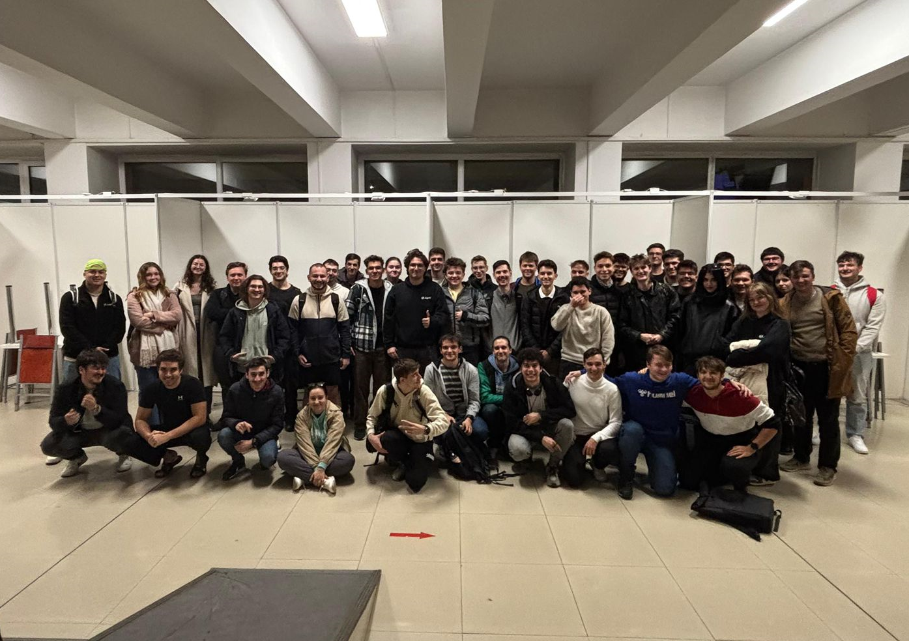

# 🛠️ Despre Docs

> Cunoașterea trebuie să fie ușor de accesat, de oriunde, de oricând, de oricine din Departamentul Tehnic.

Noi, membrii Departamentului Tehnic, am pornit această inițiativă pentru a centraliza și documenta informații relevante pentru activitatea noastră. Platforma este destinată exclusiv colegilor din departament și are ca scop sprijinirea dezvoltării continue, alinierii și transferului de cunoștințe între membri.

## 🌍 Acces de oriunde

Activitatea noastră nu se desfășoară mereu din același loc. De aceea, folosim platforma [GitBook](https://gitbook.com/?utm_campaign=ligaac&utm_source=mainpage&utm_medium=gitbook) pentru a avea documentația organizată și ușor de accesat, indiferent de context.  
Salvează site-ul [docs.ligaac.ro](https://docs.ligaac.ro) pentru acces rapid la informațiile de care ai nevoie.

## ⌛ Acces oricând

Conținutul este gândit pentru a putea fi consultat atât rapid, cât și în profunzime, în funcție de timpul disponibil. Fie că ai nevoie de o referință punctuală sau vrei să aprofundezi un subiect, informația este disponibilă oricând.

## 👩‍💻👨‍💻 Contribuție din interiorul departamentului

Orice membru al Departamentului Tehnic poate contribui.  
Această platformă este construită de departament, pentru departament. Încurajăm completarea, actualizarea și îmbunătățirea conținutului astfel încât informațiile să rămână clare, corecte și utile pentru toți colegii.  
Consultă pagina următoare pentru a vedea cum poți contribui.
